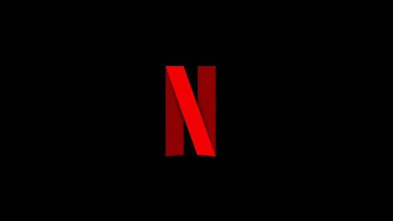

 

<h1 align="center">Netflix Clone</h1>

 <a href="#objetivo">Objetivo</a> • 
 <a href="#autor">Autor</a>

<h1>💻  Sobre o projeto</h1>

 💳  Projeto que tem o objetivo de clonar algumas paginas do netflix com o intuito de desenvolver abilidades tecnicas, pricipalmente manipulação de APIs e estilizaçåo .

<h1>🛠 Tecnologias </h1
  
<ul>
  <li>React Router</li>
  <li>styled-components</li>
  <li>axios</li>
  <li>material-UI</li>
</ul> 

<h1>Status do Projeto</h1>

<h4>finalizado ✅ </h4>

<h1>🎨 Layout</h1>

<h3>WEB</h3>

 

<h1>🚀  Como executar o projeto</h1>

Pré-requisitos:

Antes de começar, você vai precisar ter instalado em sua máquina as seguintes ferramentas: Git, Node.js. Além disto é bom ter um editor para trabalhar com o código como VSCode

<h1>🧭 Rodando a aplicação web (Frontend)</h1>

<h3>Instale as dependências</h3>

\$ npm install

<h3>Execute a aplicação em modo de desenvolvimento</h3>

\$ npm run start

O servidor inciará na porta:3000 - acesse <http://localhost:3000>

<h1 id = 'autor'>✏️ Autor</h1>

                                                                                                              
<a href="https://github.com/Duartemurilo">duarte Murilo 🌐</a></td>
                                                      
                                                      
